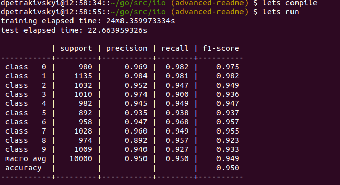

# iio
IIO is a simple neural network library written in Go. It supplies basic interfaces needed for neural network design.
Actually, this module provides tools for *Perceptron*, *Feed-Forward Network* and *Deep Feed-Forward Network* 
architectures. Data loading interfaces implemented as well - you can use either out-of-box realization of
[MNIST](http://yann.lecun.com/exdb/mnist/) handwritten digit database or write a custom data fetcher. A ready-to-use
demo network can be found under [cmd/main.go](https://github.com/xXxRisingTidexXx/iio/blob/master/cmd/main.go).
___

___
   
___

## Example
```go
package main

import (
	"fmt"
	"iio/pkg/costs"
	"iio/pkg/initial"
	"iio/pkg/layered"
	"iio/pkg/loading"
	"iio/pkg/networks"
)

func main() {
    trainingLoader, testLoader := loading.NewMNISTLoaders()  // Fetch data sets from the data source
    network := networks.NewFeedForwardNetwork(
        networks.NewOptions(
            20,  // Epoch number
            32,  // Batch size
            1,   // Learning rate
            trainingLoader,
            testLoader,
            initial.NewGlorotInitializer(),  // Initialize weights accordingly to Xavier normal distribution
            initial.NewZeroInitializer(),  // Initialize biases with zeros
            costs.NewMSECostFunction(),  // Mean Squared Error objective function
            layered.NewInputSchema(784),  // Configure input layer
            layered.NewSigmoidSchema(40), // Set 3 hidden layers with sigmoid activation function
            layered.NewSigmoidSchema(40),
            layered.NewSigmoidSchema(40),
            layered.NewSigmoidSchema(10), // Output layer should produce 1 of 10 digits
        ),
    )
    network.Train()
    fmt.Println(network.Test())  // Print classification report
}
``` 

## Usage
To compile, train and test the network demo version locally run these commands:
```bash
$ go get -t -u all
$ go get -u github.com/onsi/ginkgo/ginkgo
$ go build -o iio cmd/main.go  # Specify the output dependently on your OS
$ ./iio
``` 
If you have [lets](https://github.com/lets-cli/lets) CLI runner installed - just run these instructions:
```bash
$ lets workspace
$ lets compile
$ lets run
```
